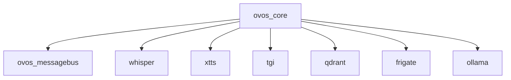

# AI_CODING_BASELINE_RULES

### How to Read This Guide
This document uses RFC 2119 keywords (MUST, SHOULD, MUST NOT, MAY) to indicate rule priorities.  
Any deviation from a MUST-level rule must follow Section X: Handling Exceptions and Deviations.  

## Table of Contents
1. [Configuration Consistency](#1-configuration-consistency)
2. [Environment Variables](#2-environment-variables)
3. [Volume Mounts and Permissions](#3-volume-mounts-and-permissions)
4. [Healthchecks and Dependencies](#4-healthchecks-and-dependencies)
5. [Version Pinning](#5-version-pinning)
6. [Testing and Verification](#6-testing-and-verification)
7. [Documentation](#7-documentation)
8. [Version Control (Git) Discipline](#8-version-control-git-discipline)
9. [AI Interaction Protocol & Change Management](#9-ai-interaction-protocol--change-management)
10. [Secrets Management](#10-secrets-management)
11. [Rollback and Recovery](#11-rollback-and-recovery)
12. [Automated Checks and Enforcement](#12-automated-checks-and-enforcement)
13. [AI/Human Collaboration Etiquette](#13-aihuman-collaboration-etiquette)
14. [Change Log Maintenance](#14-change-log-maintenance)
15. [Security Review](#15-security-review)
16. [AI Model/Tool Versioning](#16-ai-modeltool-versioning)
17. [Accessibility and Readability](#17-accessibility-and-readability)
18. [Standardized Logging Practices](#18-standardized-logging-practices)
19. [Network Design and Port Management](#19-network-design-and-port-management)
20. [Data Persistence and Backup Strategy](#20-data-persistence-and-backup-strategy)
21. [Update and Upgrade Procedures](#21-update-and-upgrade-procedures)
22. [Post-Stability Actions (Including Backups)](#22-post-stability-actions-including-backups)
23. [General Development Principles for Custom Code & Services](#23-general-development-principles-for-custom-code--services)
24. [Appendix: Example Automation Scripts & Templates](#appendix-example-automation-scripts--templates)
25. [Visualizations & Diagrams](#visualizations--diagrams)
26. [Periodic Review & Update Schedule](#periodic-review--update-schedule)
27. [Designing for Offline Capability & Portability](#27-designing-for-offline-capability--portability)
28. [Handling Exceptions and Deviations to These Rules](#x-handling-exceptions-and-deviations-to-these-rules)

> **Rule:** This guide must be referenced in all relevant code, configuration, and documentation files, and in all code reviews. Add a comment or note: "See AI_CODING_BASELINE_RULES.md for required practices."

This document defines the baseline rules and best practices that all AI agents, assistants, or automated code generation tools must follow when contributing to this project. **This guide must be referenced and adhered to whenever writing or reviewing any new code or documentation for any service in the stack.**

---

## Reviewer Checklist

| Review Item                        | Verified |
|------------------------------------|:--------:|
| AI-generated content tagged        |   [ ]    |
| Non-root container verified        |   [ ]    |
| Healthchecks & dependencies        |   [ ]    |
| Version pinning verified           |   [ ]    |
| Documentation updated              |   [ ]    |
| Rollback/Recovery scenario defined |   [ ]    |
| Security/vulnerability scan run    |   [ ]    |
| Test coverage adequate             |   [ ]    |
| Accessibility (WCAG compliance)    |   [ ]    |
| Benchmark/performance checked      |   [ ]    |
| Secrets managed securely           |   [ ]    |

---

## X. Handling Exceptions and Deviations to These Rules
<!-- id: EXC-01, priority: MUST, tags: [compliance], last_reviewed: 2025-05-13 -->
Any intentional deviation from these baseline rules must be a conscious, documented exception:
1. **Identify:** Reference the baseline rule(s) being deviated from.
2. **Justify:** Provide clear rationale for the deviation.
3. **Document:** Record the exception, justification, risks, and alternative approach in the relevant `[ServiceName]_SETUP_GUIDE.md` or `[ServiceName]_TROUBLESHOOTING_GUIDE.md` with a link back to this guide.
4. **Approve:** Obtain explicit approval from the primary maintainer before finalizing.

---

## 1. Configuration Consistency
<!-- id: CFG-01, priority: MUST, tags: [config] -->
- MUST: Always use the Docker Compose service name (e.g., `ovos_messagebus`) for all inter-container host references.
- SHOULD: Server processes SHOULD bind to `0.0.0.0` unless a specific interface is documented.
- SHOULD: Ensure all critical configuration sections match the canonical examples in `[ServiceName]_SETUP_GUIDE.md`, except under a documented exception.
- SHOULD: Namespace and document shared config file sections (e.g., `mycroft.conf`) per service in their setup guides.

## 2. Environment Variables
<!-- id: ENV-01, priority: MUST, tags: [environment] -->
- MUST: Set all required environment variables for each service in the relevant `docker-compose.*.yml` file as specified.
- MUST NOT: Override Compose-defined environment variables with hardcoded values in application code or entrypoint scripts unless explicitly documented.

## 3. Volume Mounts and Permissions
<!-- id: VOL-01, priority: MUST, tags: [volumes, permissions] -->
- MUST: Mount configuration and data directories exactly as described in each service’s setup guide, distinguishing read-only (`:ro`) vs. read-write.
- MUST: Clearly state in change previews if mounting or permission changes are intended.
- MUST: Ensure host and in-container permissions (`chmod`/`chown`) allow necessary access without granting excessive privileges.

---

## 4. Healthchecks and Dependencies
- Utilize `depends_on` (with `condition: service_healthy` where applicable) and robust `healthchecks` in Docker Compose to manage service startup order and ensure dependencies are truly ready.
- Healthcheck `test` commands should accurately reflect the service's ability to perform its core function (e.g., responding on a specific port/path, process status).
- **Prefer the `exec` form for healthchecks** (e.g., `["CMD", "executable", "arg1"]`) over the `shell` form (`CMD-SHELL "command string"`) to avoid unexpected shell expansions or signal handling issues, unless shell features are strictly necessary.
- **Always define appropriate `interval`, `timeout`, `retries`, and `start_period`** values for each healthcheck to suit the service's startup characteristics.
- Ensure the container's `CMD` or `ENTRYPOINT` correctly starts the main application process that the healthcheck is intended to monitor.
- Avoid healthchecks that always pass (e.g., ending with `|| true`) for critical services unless the reason is well-documented and accepted.

## 5. Version Pinning
- For stability and reproducibility, pin versions of base Docker images (e.g., `python:3.11-slim`), application versions (e.g., `smartgic/ovos-core:0.1.0`), and key software packages/libraries (e.g., in `requirements.txt`).
- Do not upgrade or change pinned versions without explicit review, testing (ideally on a separate branch), and documentation of the change and its impact.

## 6. Testing and Verification
- For each service, provide or update simple test scripts or manual verification procedures to confirm core functionality, health, and connectivity to its dependencies after any configuration or code changes.
- Always run relevant tests after making changes.
- **Cross-Platform Testing:**
    - If primary development occurs on Windows (Docker Desktop/WSL2), periodically test the stack on a native Linux Docker host or WSL2 to catch Windows-specific compatibility issues early.

## 7. Documentation
- For **each distinct service/container** in the stack, create and maintain:
    - A `[ServiceName]_SETUP_GUIDE.md` detailing its purpose, configuration specifics, volume mounts, exposed ports, and any unique setup steps.
    - A `[ServiceName]_TROUBLESHOOTING_GUIDE.md` (or a dedicated section within its setup guide, or within the main troubleshooting log in the `docker-compose.*.yml` file for that service) documenting common issues, diagnostic commands, and known fixes.
- This overarching 'Stack Management & AI Collaboration Baseline Guide' must be referenced in all service-specific documentation and code reviews.
- For complex inter-service dependencies, consider generating and maintaining a visual dependency graph to aid in understanding and debugging.
- Ensure all documentation (including `*.md` guides and code comments) uses clear, simple language and considers accessibility (e.g., providing alt text for diagrams or images if used).

---

## 8. Version Control (Git) Discipline
- **Commit All Changes:** All modifications to code, configuration files (Docker Compose, `mycroft.conf`, `requirements.txt`, Dockerfiles), documentation, and guides made by AI or human operators **must be committed to Git with clear, descriptive messages** detailing the change and its purpose.
- **Review Before Commit:** Human review of AI-generated changes is **mandatory** before committing, especially for critical configuration files or code. Use `git diff` to understand the exact changes.
- **Branching for Experiments:** For significant changes, experiments, or troubleshooting steps that might be reverted, use Git branches. Test thoroughly on a branch before considering a merge to the main working branch.
- **No Force Pushing:** Avoid `git push --force` on shared branches unless absolutely necessary and coordinated, as it can overwrite history.
- **Maintain `.gitignore`:** Ensure a comprehensive `.gitignore` file is used to exclude local state, logs, IDE settings, secrets, large data/model files, and other non-repository items. Periodically review and update it.
- **Regularly Pull from Remote:** Before starting new work, always pull the latest changes from the remote repository to avoid conflicts and ensure you are working with the most current baseline.
- **Commit Message Format:**
    - All commit messages should follow the [Conventional Commits](https://www.conventionalcommits.org/) specification (e.g., `feat:`, `fix:`, `docs:`, `chore:`).
    - The summary line should be ~50 characters, with body text wrapped at 72 characters.
    - Example:
      ```
      feat: add healthcheck to ovos_messagebus
      
      Adds a Docker Compose healthcheck for the ovos_messagebus service to improve startup reliability.
      ```
- **Consistent Line Endings:**
    - All text files intended for use inside Linux containers (e.g., shell scripts, configs, Python scripts) **must** use LF (Line Feed) line endings, not Windows CRLF. Enforce this with a `.gitattributes` file (e.g., `*.sh text eol=lf`, `*.py text eol=lf`, `*.yaml text eol=lf`).
    - Configure Git: `core.autocrlf = input` (Linux/macOS) or `core.autocrlf = true` (Windows) to help ensure correct line endings.
- **Case Sensitivity:**
    - Treat all filenames, directory names, module imports, and environment variable names as case-sensitive. Always use consistent casing, as Linux filesystems are case-sensitive.
- **Merge Conflict Resolution:** When Git merge conflicts arise, resolve by understanding changes from all sources, communicating with contributors as needed, and using merge tools. After resolution, **test thoroughly** to confirm functionality before finalizing the merge.
- All Infrastructure-as-Code (IaC) files (e.g., Docker Compose, Terraform, Helm charts) must be version controlled, with clear branching and tagging strategies.

## 9. AI Interaction Protocol & Change Management
- **Explicit Confirmation for Destructive Actions:** AI assistants **must always seek explicit user confirmation** before performing any potentially destructive actions. This includes, but is not limited to:
    - Deleting files or directories (especially in mounted volumes).
    - Removing Docker images, containers, volumes, or networks.
    - Overwriting existing configuration files without backup.
- **State Intent and Preview Changes:** Before applying changes, the AI should clearly state:
    - What it intends to do.
    - Which files or services will be affected.
    - The expected outcome.
    - If possible, provide a preview (like a diff) of code or configuration changes.
- **Incremental Changes:** AI should prefer making small, atomic, and incremental changes. Each change should be testable and easy to review and revert if necessary.
- **Backup Critical Files:** Before an AI modifies a critical configuration file (e.g., `mycroft.conf`, `docker-compose.ai.yml`), it should prompt the user to ensure a backup is made (e.g., `mycroft.conf` to `mycroft.conf.bak`) or offer to create one if feasible. For large Docker volumes or system-level backups, the AI will provide a reminder and a list of what to back up, but the user is responsible for performing the backup.
- **Log AI Actions:** Briefly note significant actions taken by an AI (e.g., "Copilot updated `mycroft.conf` to change `websocket.host`") in the relevant troubleshooting log if not part of a direct commit message.
- **Explicit AI Contribution Tagging:**
    - All code or configuration generated or reviewed by AI must include a standardized comment tag (e.g., `# AI-GENERATED:` or `# AI-REVIEWED:`) at the top of the file or relevant code/config block for traceability.

## 10. Secrets Management
- **No Hardcoded Secrets:** Credentials, API keys, or other secrets must **never** be hardcoded into configuration files, Dockerfiles, scripts, or committed to the Git repository.
- **Use Environment Variables & Externalized Config:** Prefer Docker secrets, environment variables passed at runtime (e.g., via a non-committed `.env` file referenced by Docker Compose), or secure vault solutions for managing secrets.
- **Secret Rotation Intervals:**
    - Define and document specific rotation intervals for all secrets based on their sensitivity and risk profile. Review and rotate secrets at least quarterly, or immediately upon suspected compromise.
- Establish a regular schedule for secret rotation and document the process.
- Implement audit logging for secret access and changes where possible.
- Have a plan for emergency secret revocation and rotation.

## 11. Rollback and Recovery
- Always ensure you know how to roll back changes. Use `git revert`, restore from backups, or use Docker volume snapshots as appropriate (note: basic Docker local volumes/host-mounted directories do not support built-in snapshots; use file system backups for these).
- Before making major or potentially breaking changes, ensure a backup or restore point exists.
- **Rollback Scenario Examples:**
    - *Code regression:* Use `git revert <commit_hash>` to undo a problematic commit.
    - *Configuration error:* Restore a critical config file from a `.bak` backup or previous Git version, then restart the affected service(s).
    - *Data volume issue:* Restore the relevant host-mounted directory from the last known good backup (may require stopping the service during restore).

## 12. Automated Checks and Enforcement
- Use automated tools for linting, formatting, and validating configuration files (e.g., JSON/YAML linters, Docker Compose validators, pre-commit hooks).
- Automated checks should run before merging or deploying changes.
- Provide and recommend pre-commit hook configurations (e.g., for linting, formatting, YAML/JSON validation) using the [pre-commit](https://pre-commit.com/) framework.
- Instrument CI/CD pipelines to track metrics such as build frequency, failure rates, build/test duration, and code coverage. Set up alerts for failures or regressions.
- **Commit Message Tooling:**
    - Integrate tools like `commitlint` or Husky into your pre-commit or CI/CD pipeline to automatically enforce Conventional Commits and the 50/72 line length rule for commit messages.
- **CI/CD Examples:**
    - Example tools: GitHub Actions, GitLab CI, Jenkins, Travis CI, CircleCI, Azure Pipelines. Use these to automate linting, testing, builds, and deployments as appropriate for your stack.

## 13. AI/Human Collaboration Etiquette
- All AI-generated suggestions must be open to human review.
- Humans are encouraged to leave comments or feedback for the AI (or future contributors) directly in code reviews or commit messages.
- **Evaluating Conflicting Advice:** If AI assistants or human experts provide conflicting suggestions, the human reviewer must:
  1. Evaluate each suggestion against project goals and baseline rules.
  2. Seek clarification if needed.
  3. Make the final decision.
  4. **Document** the conflict, decision process, and rationale in commit messages, code review comments, or service-specific guides.

## 14. Change Log Maintenance
- Maintain a `CHANGELOG.md` or similar file to track significant changes, especially those made by AI, for transparency and traceability.

## 15. Security Review
- Periodically review dependencies and Docker images for vulnerabilities (e.g., using `pip-audit`, `docker scan`, or similar tools).
- Update dependencies and images responsibly, following version pinning and review rules.
- Regularly scan dependencies and Docker images for known vulnerabilities using tools like `pip-audit` (for Python), `docker scan`, Trivy, Grype, Snyk, or GitHub Advanced Security.
- **Containerization Security:**
    - Containers should run as a non-root user unless specifically justified and documented. Always prefer the principle of least privilege for container processes.
- **Linux Base Images:**
    - All custom Docker images must use Linux-based parent images (e.g., `python:3.11-slim`, `debian:bookworm-slim`, `alpine`). Do not introduce Windows-based containers into this stack.

## 16. AI Model/Tool Versioning
- If multiple AI tools or Copilot versions are used, specify which version or model was used for a given change (if possible), especially for major updates or migrations.

## 17. Accessibility and Readability
- Write clear, concise, and accessible documentation and code comments so both humans and AI can easily understand the intent and function of all changes.
- Where applicable (e.g., for any user-facing web interfaces, GUIs, or public documentation), strive for compliance with relevant accessibility standards, such as WCAG 2.1 (Web Content Accessibility Guidelines) at an A or AA level.
- **Accessibility Auditing Tools:**
    - Utilize automated accessibility checking tools (e.g., axe-core, Lighthouse, Pa11y, HTML_CodeSniffer) during development and testing of user-facing components and documentation to verify WCAG 2.1 compliance.

---

## 18. Standardized Logging Practices
- **Console Output:** Ensure all containerized applications log to `stdout` and `stderr` to be easily captured by `docker logs <container_name>`. Avoid logging only to internal files unless absolutely necessary and documented.
- **Log Levels:** Utilize configurable log levels (e.g., DEBUG, INFO, WARNING, ERROR) for each service. Document how to change the log level (e.g., via environment variable or config file) in the service's setup guide. Default to `INFO` for production-like stability, use `DEBUG` for troubleshooting.
- **Structured Logging:** Prefer structured logging (e.g., JSON format) for logs where feasible, to enable easier parsing and analysis by log management tools.
- All logs should be ephemeral and routed to stdout/stderr, not written to persistent files inside containers.

## 19. Network Design and Port Management
- **Explicit Networks:** Define explicit Docker bridge networks in your `docker-compose.*.yml` files for groups of related services (e.g., `ovos_network`, `monitoring_network`) rather than relying solely on the default bridge network. This improves isolation and service discovery predictability.
- **Port Conflicts:** Before assigning host ports in `ports:` mappings, check for existing port usage on the host to avoid conflicts. Document all exposed host ports clearly.
- **Inter-Service Dependencies:** Document which services need to communicate with each other and on which internal ports/routes in their respective setup guides.

## 20. Data Persistence and Backup Strategy
- **Volume Strategy:** Clearly define for each service which data is ephemeral and which requires persistent storage via named Docker volumes or host-mounted directories. Document this in the service's setup guide and the main "Backup and Restore" section of `docker-compose.ai.yml`.
- **Backup Reminders:** Reiterate that after significant stable changes, the AI should prompt for a backup of both version-controlled files (Git) and persistent data volumes.

## 21. Update and Upgrade Procedures
- **Image Updates:** Prefer specific version tags for images over `latest` for critical services to ensure predictability. Document the process for checking for updates and applying them (e.g., `docker-compose pull <service_name>`, then `docker-compose up -d --force-recreate <service_name>`).
- **Application/Library Updates:** Changes to internal libraries (e.g., in `requirements.txt`) should be tested on a branch before merging and deploying.
- **Breaking Changes:** Note any known breaking changes between versions of services or their key dependencies in the relevant troubleshooting or setup guides.

## 22. Post-Stability Actions (Including Backups)
1. Once a new configuration, build, or set of changes has been thoroughly tested and confirmed stable by the user, the user will inform the AI assistant.
2. Upon this confirmation, the AI assistant **must remind the user to perform a comprehensive backup.**
3. This reminder should include:
    - Ensuring all code, configuration files (`docker-compose.ai.yml`, `mycroft.conf`, `Dockerfile`, `requirements.txt`, `*.md` guides, etc.) are committed to Git with a clear version tag or commit message.
    - Performing a backup of all persistent data volumes as outlined in the "Backup and Restore" section of `docker-compose.ai.yml` (this includes `./ovos_config/config`, `./ovos_config/data`, and data for other services like Frigate, Ollama, XTTS, etc.). This might involve stopping relevant containers to ensure data consistency during the copy.
    - Optionally, tagging the newly built stable Docker images (e.g., `custom-ovos-core:stable-YYYYMMDD`) and considering pushing them to a private Docker registry if applicable.

---

## 23. General Development Principles for Custom Code & Services

This section outlines general software development best practices applicable to any custom code written for services within this stack (e.g., Python scripts for OVOS skills, new containerized applications, modifications to existing open-source components). These principles complement the stack management and AI collaboration rules already defined.

### 23.1. Code Quality, Readability, and Maintainability
1.  **Clarity and Simplicity:**
    * Write code that is clean, clear, easy to understand, and well-formatted.
    * Adhere to established style guides for the programming language used (e.g., PEP 8 for Python).
    * Prioritize simplicity and avoid unnecessary complexity.
2.  **Maintainability:**
    * Strive for code that is easy to modify, debug, and extend.
    * Regularly identify and perform refactoring to improve code structure, remove duplication (DRY - Don't Repeat Yourself), and enhance clarity without altering external behavior.
3.  **Self-Documenting Code & Comments:**
    * Use meaningful and descriptive names for variables, functions, classes, and modules.
    * Write clear docstrings for public modules, classes, and functions.
    * Supplement with inline comments only for complex logic, non-obvious decisions, or to explain "why" something is done a certain way, not just "what" it does.
4.  **Language and Framework Standards:**
    * Adhere to the latest stable standards and idiomatic practices of the primary programming language and frameworks used for each service.
    * Keep dependencies (libraries, frameworks) reasonably up-to-date, carefully considering stability, security patches, and breaking changes (refer to Section 5: Version Pinning and Section 21: Update and Upgrade Procedures).
5.  **Code Examples:**
    * When introducing new features, complex logic, or APIs, provide clear, functional, and self-sufficient code examples in documentation or tests where appropriate.
6.  **OS-Agnostic Path Separators:**
    * In scripts, application code, and config files used by or within Linux containers, always use POSIX-style forward slashes (`/`). Avoid hardcoding Windows-style backslashes (`\`).
    * In Python, use `os.path.join()` or `pathlib` for OS-agnostic paths if code may run on both host and container.

### 23.2. Design and Architecture Principles
1.  **Modularity and Single Responsibility (SRP):**
    * Design components (modules, classes, functions) to be modular with well-defined, single responsibilities. Each component should do one thing and do it well.
2.  **Abstraction and Decoupling (DIP, ISP):**
    * Promote code reuse and reduce coupling between components through appropriate levels of abstraction.
    * Utilize interfaces (e.g., Python Abstract Base Classes - ABCs) or clearly defined service contracts to decouple components. Depend on abstractions, not concretions.
3.  **Extensibility (OCP):**
    * Design software to be open for extension but closed for modification where appropriate, allowing new functionality to be added with minimal changes to existing, tested code.
4.  **Software Design Patterns:**
    * Implement and justify the use of suitable software design patterns (e.g., Factory, Observer, Strategy, Decorator) to solve common problems effectively and improve code structure. Document the chosen pattern and its rationale.
5.  **SOLID Principles:**
    * Strive to follow SOLID principles (Single Responsibility, Open/Closed, Liskov Substitution, Interface Segregation, Dependency Inversion) for robust, flexible, and maintainable object-oriented design.
6.  **Dependency Injection:**
    * Employ dependency injection (DI) where appropriate to provide components with their dependencies, rather than having them create or look them up directly. This improves testability, flexibility, and reduces coupling.

### 23.3. Error Handling and Robustness
1.  **Graceful Error Handling:**
    * Implement comprehensive error handling using try-except blocks (or equivalent language constructs) to catch and manage exceptions appropriately. Avoid catching overly broad exceptions unless re-raising or handling specifically.
2.  **Custom Exceptions:**
    * Define and use custom exception types for application-specific error conditions to provide more meaningful error information and allow for more granular error handling.
3.  **Logging for Errors:**
    * Log all caught exceptions and significant error states with sufficient detail (e.g., stack trace, relevant context, input parameters if safe to log) to aid in debugging. Refer to Section 18: Standardized Logging Practices.
4.  **Input Validation:**
    * Rigorously validate all external inputs (e.g., user input, API requests, data from other services, configuration values) at the boundaries of your components to prevent errors and common security vulnerabilities.

### 23.4. Performance and Scalability
1.  **Efficient Algorithms & Data Structures:**
    * Choose and implement data structures and algorithms that are appropriate for the task and data size to ensure good performance characteristics.
2.  **Concurrency and Parallelism:**
    * For I/O-bound or computationally intensive tasks that can be parallelized, utilize appropriate concurrency mechanisms (e.g., Python's `asyncio` for asynchronous operations, `threading` for I/O-bound tasks, or `multiprocessing` for CPU-bound tasks where suitable). Understand the Global Interpreter Lock (GIL) implications in Python when using threads for CPU-bound work.
3.  **Profiling and Optimization:**
    * If performance issues are suspected or known, use profiling tools specific to the language/runtime to identify actual bottlenecks before attempting optimizations.
    * Focus optimization efforts on critical paths and proven bottlenecks. Document significant optimizations.
4.  **Resource Management:**
    * Ensure efficient use of system resources (CPU, memory, disk I/O, network bandwidth).
    * Implement proper cleanup for managed and unmanaged resources (e.g., using context managers like `with` in Python for files and network connections, or implementing `__enter__` and `__exit__` for custom resource managers).
5.  **Performance Benchmarking:**
    * For performance-sensitive services, establish baseline performance metrics and regularly benchmark key operations. Re-run benchmarks after significant updates to detect regressions.

### 23.5. Testing and Quality Assurance
1.  **Unit Testing:**
    * Implement comprehensive unit tests for new and modified code to verify the correctness of individual functions, methods, and classes in isolation.
    * Aim for high test coverage of business logic and critical code paths.
    * Use appropriate testing frameworks for the language (e.g., `pytest` or `unittest` for Python).
2.  **Integration Testing:**
    * Where components or services interact, write integration tests to ensure they work together correctly (e.g., testing the interaction between `ovos-core` and `ovos_messagebus` via script, or service-to-database connections).
3.  **Testable Code:**
    * Write code that is inherently testable. This is often facilitated by following principles like SRP, DI, and using interfaces/abstractions. Avoid hard-to-mock dependencies or global state where possible.

### 23.6. Security Best Practices
1.  **Input Validation & Sanitization:** (Reiterated for emphasis) Validate and sanitize all inputs from untrusted sources to prevent injection attacks (SQLi, XSS, command injection, etc.), path traversal, and other common vulnerabilities.
2.  **Principle of Least Privilege:** Ensure that processes and services run with the minimum permissions necessary to perform their intended functions. This applies to file system access, network access, and database permissions.
3.  **Dependency Security:** Regularly scan and update third-party libraries and dependencies to patch known vulnerabilities (refer to Section 15: Security Review).
4.  **Data Protection:** If handling sensitive data, ensure appropriate measures are in place for its protection, such as encryption (at rest and in transit) and strict access controls. Avoid logging sensitive data.

### 23.7. CI/CD (Continuous Integration & Continuous Deployment)
1.  **Automated Processes:** Strive for automation in build, test, and deployment processes. Code should be compatible with CI/CD pipelines.
2.  **Environment Consistency:** Aim for consistency between development, testing, and production/deployment environments, often facilitated by containerization (like Docker) and declarative configuration.

### 23.8. Python-Specific Development Guidelines

These guidelines apply to all Python code developed for or integrated into this stack, supplementing the "General Development Principles."

1.  **Coding Standards & Readability:**
    * **PEP 8:** All Python code **must** adhere to the PEP 8 style guide. Consistent formatting is crucial for readability and maintainability.
    * **Type Hinting (PEP 484+):** Python code **should** use type hints for function arguments, return values, and variables where it improves clarity and allows for static analysis. Aim for gradual adoption in existing codebases if not already present.
    * **Docstrings:** All public modules, classes, functions, and methods **must** have docstrings in a standard format (e.g., Google, reStructuredText, or NumPy style) that clearly explains their purpose, arguments, and return values.
    * **Linters & Formatters:** It is **highly recommended** to use and configure linters like `Flake8` or `Pylint`, and code formatters like `Black` and `isort` to enforce style consistency and catch potential issues early. These can be integrated into pre-commit hooks.

2.  **Pythonic Code & Design:**
    * **Embrace Pythonic Idioms:** Write code that is idiomatic to Python, leveraging its features for clarity and conciseness (e.g., list comprehensions, generator expressions, context managers, enumerate).
    * **Modules and Packages:** Organize code into well-structured modules and packages with clear responsibilities and minimal circular dependencies. Use `__init__.py` files effectively to define package structure and public APIs.
    * **Abstract Base Classes (ABCs):** When defining interfaces or abstract concepts, use Python's `abc` module to create Abstract Base Classes.
    * **Decorators:** Utilize decorators for common cross-cutting concerns like logging, timing, caching, or modifying function/method behavior in a clean way.
    * **Context Managers (`with` statement):** Employ the `with` statement for robust management of resources that need to be set up and torn down (e.g., file handles, network connections, database sessions, locks).

3.  **Error Handling:**
    * **Specific Exceptions:** Catch specific exceptions rather than generic `Exception` where possible. Use Python's built-in exception hierarchy effectively and create custom exception classes inheriting from appropriate bases for application-specific errors.
    * **Resource Cleanup:** Ensure resources are always released, typically using `try...finally` blocks or, preferably, context managers.

4.  **Performance & Concurrency:**
    * **`asyncio`:** For I/O-bound operations where concurrency can improve responsiveness (e.g., managing multiple network requests, non-blocking operations), **strongly consider** using the `asyncio` framework with `async` and `await`.
    * **`multiprocessing`:** For CPU-bound tasks that need to bypass the Global Interpreter Lock (GIL) for true parallelism, use the `multiprocessing` module.
    * **Generators and Iterators:** Use generators and iterators for memory-efficient processing of large sequences or data streams.
    * **Built-ins and Optimized Libraries:** Prefer Python's built-in functions and highly optimized C-extension libraries (like NumPy for numerical operations, if applicable) for performance-critical sections.
    * **Profiling:** Use Python's built-in `cProfile` and `profile` modules, or tools like `line_profiler` or `memory_profiler`, to identify performance bottlenecks before optimizing.

5.  **Testing:**
    * **Frameworks:** Use established Python testing frameworks like `pytest` (recommended for its conciseness and rich plugin ecosystem) or the built-in `unittest`.
    * **Mocking:** Utilize mocking libraries (e.g., `unittest.mock`, `pytest-mock`) to isolate units under test and control dependencies.
    * **Code Coverage:** Measure test coverage using tools like `coverage.py` and strive for comprehensive coverage of critical code paths.
    * **Test Structure:** Organize tests in a clear structure, typically in a separate `tests/` directory, mirroring your application's package structure.

6.  **Dependency Management & Environments:**
    * **Virtual Environments:** All Python development and execution **must** occur within dedicated virtual environments (e.g., using `venv` or `conda`) to isolate project dependencies and avoid conflicts. This is handled by Docker for containerized services.
    * **`requirements.txt`:** List all Python dependencies with pinned versions (e.g., `package_name==X.Y.Z` or `package_name>=X.Y,<X.Z`) in a `requirements.txt` file for reproducible builds.
    * **Dependency Updates:** Regularly review and update dependencies (refer to Section 15: Security Review and Section 21: Update and Upgrade Procedures), testing thoroughly.

7.  **Python-Specific Security:**
    * **Avoid `pickle` with Untrusted Data:** Be aware of the security risks of unpickling data from untrusted sources, as it can lead to arbitrary code execution. Prefer safer serialization formats like JSON for data exchange where possible.
    * **Input Sanitization for Web Contexts:** If any Python service involves web interfaces (e.g., using Flask, Django, FastAPI), ensure all principles of web security (XSS prevention, CSRF protection, secure handling of uploads, etc.) are followed.
    * **Secrets in Environment:** For local development outside Docker, use libraries like `python-dotenv` to load secrets from `.env` files (which should be in `.gitignore`) into environment variables.

---

## Conflict Resolution Matrix
<!-- id: CRM-01, priority: SHOULD, tags: [process] -->
| Scenario                         | Rules in Tension                     | Resolution                                      |
|----------------------------------|--------------------------------------|-------------------------------------------------|
| Security vs. Performance         | Section 15 security vs. Section 24 performance | Security (Section 15) takes precedence; document performance trade-offs. |
| Stability vs. Latest Features    | Sections 5 pinning vs. 21 updates     | Pin stable versions, test updates on branch; document when adopting new features. |
| Automated Checks vs. Developer Speed | Section 12 enforcement vs. Section 23 agility | Enforcement should not block agility; use `MAY` for optional checks during early dev. |

---

## Appendix: Example Automation Scripts & Templates

### Example Docker Compose Snippet (Healthchecks & Explicit Networks)

```yaml
version: '3.8'
services:
  example_service:
    image: example/image:1.0.0
    container_name: example_service
    restart: unless-stopped
    networks:
      - example_network
    healthcheck:
      test: ["CMD", "curl", "-f", "http://localhost:8080/health"]
      interval: 10s
      timeout: 5s
      retries: 3
      start_period: 15s
    environment:
      - EXAMPLE_ENV=production
    ports:
      - "8080:8080"
networks:
  example_network:
    driver: bridge
```

---

## Visualizations & Diagrams

- For complex stacks, generate and include service dependency graphs or flowcharts.
- Tools: [Mermaid](https://mermaid-js.github.io/), [Graphviz](https://graphviz.gitlab.io/), or [draw.io](https://app.diagrams.net/).
- Example (Mermaid):



---

## Periodic Review & Update Schedule

- **Review Frequency:** These guidelines must be reviewed and updated at least quarterly (every 3 months) or after any major stack or process change.
- **Review Process:**
    - Assign a maintainer or rotating reviewer.
    - Solicit feedback from all contributors (AI and human).
    - Document all changes in `CHANGELOG.md`.
    - Confirm continued alignment with industry best practices and project needs.

---

## 27. Designing for Offline Capability & Portability

*To maximize the stack's ability to be deployed and maintained in offline or air-gapped environments, the following principles apply:*

1.  **Minimize Online Dependencies for Core Functionality:**
    * Services **should be designed and configured** to perform their core functions without requiring continuous internet access, where feasible.
    * Clearly differentiate between essential offline functionality and features that inherently require an internet connection (e.g., fetching live news, certain cloud-based AI models).
2.  **Explicitly Document Online Requirements:**
    * For any service, plugin, or feature that *does* require internet access (even if only for initial setup like model downloads or package installation), this dependency **must be clearly documented** in its respective `[ServiceName]_SETUP_GUIDE.md`. Include details about what is fetched and when.
3.  **Support for Localized Resources:**
    * Configurations **must** allow services to be pointed to locally hosted resources (e.g., local model directories, local package repositories, local service endpoints) instead of relying solely on hardcoded public internet URLs. This is crucial for offline operation.
4.  **Dockerfile and Build Process Considerations for Offline Builds:**
    * Custom Docker image builds **should strive to support offline assembly** once all initial base images and source dependencies (code, packages, models) have been pre-fetched during an online phase.
    * This may involve:
        * Using multi-stage Docker builds to separate online-dependent fetching/compilation from the final offline-buildable image.
        * Strategies for vendoring dependencies (e.g., Python wheels, system packages) if local mirrors are not used.
        * Ensuring build scripts do not attempt to reach the internet if an "offline build" mode is active or if local resources are present.
5.  **Configuration Over Internet Checks:**
    * Services should provide configuration options to disable automatic update checks or other non-essential internet call-outs if they might fail or cause issues in an offline environment.

---

**This guide is mandatory. All new code, configuration, and documentation must comply with these rules.**
