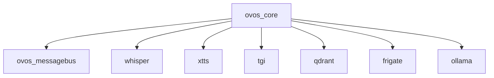

# AI_CODING_BASELINE_RULES

### How to Read This Guide
This document uses RFC 2119 keywords (MUST, SHOULD, MUST NOT, MAY) to indicate rule priorities.  
Any deviation from a MUST-level rule must follow Section X: Handling Exceptions and Deviations.  

## Table of Contents
1. [Configuration Consistency](#1-configuration-consistency)
2. [Environment Variables](#2-environment-variables)
3. [Volume Mounts and Permissions](#3-volume-mounts-and-permissions)
4. [Healthchecks and Dependencies](#4-healthchecks-and-dependencies)
5. [Version Pinning](#5-version-pinning)
6. [Testing and Verification](#6-testing-and-verification)
7. [Documentation](#7-documentation)
8. [Version Control (Git) Discipline](#8-version-control-git-discipline)
9. [AI Interaction Protocol & Change Management](#9-ai-interaction-protocol--change-management)
10. [Secrets Management](#10-secrets-management)
11. [Rollback and Recovery](#11-rollback-and-recovery)
12. [Automated Checks and Enforcement](#12-automated-checks-and-enforcement)
13. [AI/Human Collaboration Etiquette](#13-aihuman-collaboration-etiquette)
14. [Change Log Maintenance](#14-change-log-maintenance)
15. [Security Review](#15-security-review)
16. [AI Model/Tool Versioning](#16-ai-modeltool-versioning)
17. [Accessibility and Readability](#17-accessibility-and-readability)
18. [Standardized Logging Practices](#18-standardized-logging-practices)
19. [Network Design and Port Management](#19-network-design-and-port-management)
20. [Data Persistence and Backup Strategy](#20-data-persistence-and-backup-strategy)
21. [Update and Upgrade Procedures](#21-update-and-upgrade-procedures)
22. [Post-Stability Actions (Including Backups)](#22-post-stability-actions-including-backups)
23. [General Development Principles for Custom Code & Services](#23-general-development-principles-for-custom-code--services)
24. [Appendix: Example Automation Scripts & Templates](#appendix-example-automation-scripts--templates)
25. [Visualizations & Diagrams](#visualizations--diagrams)
26. [Periodic Review & Update Schedule](#periodic-review--update-schedule)
27. [Designing for Offline Capability & Portability](#27-designing-for-offline-capability--portability)
28. [Handling Exceptions and Deviations to These Rules](#x-handling-exceptions-and-deviations-to-these-rules)

> **Rule:** This guide must be referenced in all relevant code, configuration, and documentation files, and in all code reviews. Add a comment or note: "See AI_CODING_BASELINE_RULES.md for required practices."

This document defines the baseline rules and best practices that all AI agents, assistants, or automated code generation tools must follow when contributing to this project. **This guide must be referenced and adhered to whenever writing or reviewing any new code or documentation for any service in the stack.**

---

## Reviewer Checklist

| Review Item                        | Verified |
|------------------------------------|:--------:|
| AI-generated content tagged        |   [ ]    |
| Non-root container verified        |   [ ]    |
| Healthchecks & dependencies        |   [ ]    |
| Version pinning verified           |   [ ]    |
| Documentation updated              |   [ ]    |
| Rollback/Recovery scenario defined |   [ ]    |
| Security/vulnerability scan run    |   [ ]    |
| Test coverage adequate             |   [ ]    |
| Accessibility (WCAG compliance)    |   [ ]    |
| Benchmark/performance checked      |   [ ]    |
| Secrets managed securely           |   [ ]    |

---

## X. Handling Exceptions and Deviations to These Rules
<!-- id: EXC-01, priority: MUST, tags: [compliance], last_reviewed: 2025-05-13 -->
Any intentional deviation from these baseline rules must be a conscious, documented exception:
1. **Identify:** Reference the baseline rule(s) being deviated from.
2. **Justify:** Provide clear rationale for the deviation.
3. **Document:** Record the exception, justification, risks, and alternative approach in the relevant `[ServiceName]_SETUP_GUIDE.md` or `[ServiceName]_TROUBLESHOOTING_GUIDE.md` with a link back to this guide.
4. **Approve:** Obtain explicit approval from the primary maintainer before finalizing.

---

## 1. Configuration Consistency
<!-- id: CFG-01, priority: MUST, tags: [config] -->
- MUST: Always use the Docker Compose service name (e.g., `ovos_messagebus`) for all inter-container host references.
- SHOULD: Server processes SHOULD bind to `0.0.0.0` unless a specific interface is documented.
- SHOULD: Ensure all critical configuration sections match the canonical examples in `[ServiceName]_SETUP_GUIDE.md`, except under a documented exception.
- SHOULD: Namespace and document shared config file sections (e.g., `mycroft.conf`) per service in their setup guides.

## 2. Environment Variables
<!-- id: ENV-01, priority: MUST, tags: [environment] -->
- MUST: Set all required environment variables for each service in the relevant `docker-compose.*.yml` file as specified.
- MUST NOT: Override Compose-defined environment variables with hardcoded values in application code or entrypoint scripts unless explicitly documented.

## 3. Volume Mounts and Permissions
<!-- id: VOL-01, priority: MUST, tags: [volumes, permissions] -->
- MUST: Mount configuration and data directories exactly as described in each service’s setup guide, distinguishing read-only (`:ro`) vs. read-write.
- MUST: Clearly state in change previews if mounting or permission changes are intended.
- MUST: Ensure host and in-container permissions (`chmod`/`chown`) allow necessary access without granting excessive privileges.

---

## 4. Healthchecks and Dependencies
<!-- id: HC-01, priority: SHOULD, tags: [docker, healthchecks] -->
- SHOULD: Use `depends_on` with `condition: service_healthy` and robust healthcheck definitions.
- SHOULD: Prefer the exec form (`["CMD", …]`) over shell form for reliability.
- SHOULD: Tune `interval`, `timeout`, `retries`, and `start_period` to match service startup behavior.
- MUST NOT: Use always-passing healthchecks (e.g., ending in `|| true`) for critical services unless a documented exception exists.

## 5. Version Pinning
<!-- id: PIN-01, priority: SHOULD, tags: [docker, versioning] -->
- SHOULD: Pin base images, application versions, and key libraries (e.g., `python:3.11-slim`, `smartgic/ovos-core:0.1.0`).
- MUST: Document and test any version updates on a separate branch before merging.

## 6. Testing and Verification
<!-- id: TEST-01, priority: SHOULD, tags: [testing, verification] -->
- SHOULD: Provide test scripts or manual verification procedures for core functionality after changes.
- MUST: Run all relevant tests following modifications.
- SHOULD: Test on both Windows (Docker Desktop/WSL2) and native Linux hosts to catch cross-platform issues.

## 7. Documentation
<!-- id: DOC-01, priority: SHOULD, tags: [documentation] -->
- MUST: Maintain a `[ServiceName]_SETUP_GUIDE.md` and a `[ServiceName]_TROUBLESHOOTING_GUIDE.md` for each container.
- SHOULD: Reference this baseline guide in all service-specific documentation.
- SHOULD: Provide visual dependency diagrams (e.g., Mermaid, Graphviz) for complex stacks.
- SHOULD: Ensure documentation uses simple language and includes alt-text for images.

---

<!-- id: VCS-01, priority: MUST, tags: [git,version-control] -->
## 8. Version Control (Git) Discipline
- MUST: Commit all changes to code, configuration, and documentation with clear, descriptive messages following Conventional Commits.
- MUST: Require human review of AI-generated changes before commit; use `git diff` to inspect changes.
- SHOULD: Use branches for experiments and significant changes; test thoroughly on branches before merging.
- MUST NOT: Use `git push --force` on shared branches unless coordinated and documented.
- MUST: Maintain a comprehensive `.gitignore` and review it regularly.
- MUST: Pull latest changes before starting new work to avoid conflicts.
- MUST: Follow commit message format: summary line ~50 characters, body wrapped at 72 characters, using Conventional Commits.
- MUST: Enforce LF line endings for Linux files via `.gitattributes` and Git settings.
- MUST: Treat filenames, imports, and environment variable names as case-sensitive.
- SHOULD: Resolve merge conflicts by understanding all changes and testing thoroughly before finalizing.

<!-- id: AIP-01, priority: MUST, tags: [ai,change-management] -->
## 9. AI Interaction Protocol & Change Management
- MUST: Seek explicit user confirmation before performing any destructive action.
- MUST: Clearly state intent, affected files/services, and expected outcomes before applying changes.
- MUST: Make changes incrementally and atomically; each change must be testable and reviewable.
- SHOULD: Prompt for backups of critical files before modification or advise user to back up large volumes.
- SHOULD: Log AI actions in commit messages or relevant logs with standardized tags (`AI-GENERATED`, `AI-REVIEWED`).

<!-- id: SEC-01, priority: MUST, tags: [secrets] -->
## 10. Secrets Management
- MUST: Never hardcode credentials or secrets in code, configuration, or documentation.
- MUST: Use Docker secrets, environment variables, or external vaults for secret management.
- SHOULD: Define and document secret rotation intervals; rotate at least quarterly.
- SHOULD: Establish audit logging for secret access and changes.
- MUST: Have an emergency plan for secret revocation and rotation.

<!-- id: ROR-01, priority: MUST, tags: [rollback,recovery] -->
## 11. Rollback and Recovery
- MUST: Know rollback procedures (e.g., `git revert`, backup restore) before making significant changes.
- MUST: Ensure backups or restore points exist before breaking changes.
- SHOULD: Document rollback scenarios and examples in service-specific guides.

<!-- id: AUTO-01, priority: SHOULD, tags: [automation,ci] -->
## 12. Automated Checks and Enforcement
- SHOULD: Use linting, formatting, and validation tools (e.g., pre-commit hooks) before merges.
- MUST: Run automated checks on relevant files upon each change.
- SHOULD: Integrate commitlint or Husky to enforce Conventional Commits.
- SHOULD: Instrument CI/CD to track build/test metrics and set alerts for failures.

<!-- id: AHC-01, priority: SHOULD, tags: [ai,collaboration] -->
## 13. AI/Human Collaboration Etiquette
- SHOULD: Always allow human review of AI-generated suggestions.
- SHOULD: Encourage human feedback in code reviews and commit messages.
- MUST: Document conflicting advice, decision process, and rationale in commits or guides.

<!-- id: CHG-01, priority: MUST, tags: [changelog] -->
## 14. Change Log Maintenance
- MUST: Maintain `CHANGELOG.md` to track significant changes.
- SHOULD: Note AI-made changes explicitly for transparency.

<!-- id: SEC-REV-01, priority: SHOULD, tags: [security] -->
## 15. Security Review
- SHOULD: Periodically scan dependencies and images for vulnerabilities (e.g., `pip-audit`, Trivy).
- SHOULD: Test updates on branches before merging.
- MUST: Run vulnerability scans using tools like Snyk or GitHub Advanced Security.
- MUST: Run containers as non-root users; document exceptions.
- MUST: Use Linux-based parent images; avoid Windows containers.

<!-- id: MODEL-VER-01, priority: SHOULD, tags: [ai,versioning] -->
## 16. AI Model/Tool Versioning
- SHOULD: Specify AI tool or model versions used for significant changes.

<!-- id: ACC-01, priority: SHOULD, tags: [accessibility] -->
## 17. Accessibility and Readability
- SHOULD: Write clear, concise documentation; strive for WCAG 2.1 compliance.
- SHOULD: Use automated accessibility tools (e.g., axe-core, Lighthouse).

<!-- id: LOG-01, priority: SHOULD, tags: [logging] -->
## 18. Standardized Logging Practices
- MUST: Log to stdout/stderr; avoid internal files unless documented.
- SHOULD: Use configurable log levels; default to INFO in production.
- SHOULD: Prefer structured logging (e.g., JSON) where feasible.

<!-- id: NET-01, priority: SHOULD, tags: [network] -->
## 19. Network Design and Port Management
- SHOULD: Define explicit Docker networks for related services.
- MUST: Check for host port conflicts before exposing.
- SHOULD: Document inter-service communication in setup guides.

<!-- id: DATA-01, priority: MUST, tags: [data,persistence] -->
## 20. Data Persistence and Backup Strategy
- MUST: Define ephemeral vs. persistent data per service; document in setup guides.
- SHOULD: Remind to backup version-controlled files and volumes after stable changes.

<!-- id: UPG-01, priority: SHOULD, tags: [updates] -->
## 21. Update and Upgrade Procedures
- SHOULD: Use specific version tags over `latest` for predictability.
- MUST: Test image and dependency updates on branches before merging.
- SHOULD: Document known breaking changes in troubleshooting guides.

<!-- id: POST-01, priority: SHOULD, tags: [backup,post-deployment] -->
## 22. Post-Stability Actions (Including Backups)
- MUST: Upon stability confirmation, remind user to backup code, configs, and volumes.

---

<!-- id: DEV-01, priority: SHOULD, tags: [development,custom-code] -->
## 23. General Development Principles for Custom Code & Services

<!-- id: DEV-02, priority: SHOULD, tags: [quality,readability] -->
### 23.1. Code Quality, Readability, and Maintainability
- MUST: Write code that is clean, clear, easy to understand, and well-formatted.
- MUST: Adhere to established style guides for the programming language used (e.g., PEP 8 for Python).
- SHOULD: Prioritize simplicity and avoid unnecessary complexity.
- MUST: Strive for code that is easy to modify, debug, and extend through ongoing refactoring (DRY - Don't Repeat Yourself).
- MUST: Use meaningful and descriptive names for variables, functions, classes, and modules, and write clear docstrings for public interfaces.
- SHOULD: Supplement with inline comments only for complex logic or non-obvious decisions, explaining the "why" and not the "what."

### 23.2. Design and Architecture Principles
1.  **Modularity and Single Responsibility (SRP):**
    * Design components (modules, classes, functions) to be modular with well-defined, single responsibilities. Each component should do one thing and do it well.
2.  **Abstraction and Decoupling (DIP, ISP):**
    * Promote code reuse and reduce coupling between components through appropriate levels of abstraction.
    * Utilize interfaces (e.g., Python Abstract Base Classes - ABCs) or clearly defined service contracts to decouple components. Depend on abstractions, not concretions.
3.  **Extensibility (OCP):**
    * Design software to be open for extension but closed for modification where appropriate, allowing new functionality to be added with minimal changes to existing, tested code.
4.  **Software Design Patterns:**
    * Implement and justify the use of suitable software design patterns (e.g., Factory, Observer, Strategy, Decorator) to solve common problems effectively and improve code structure. Document the chosen pattern and its rationale.
5.  **SOLID Principles:**
    * Strive to follow SOLID principles (Single Responsibility, Open/Closed, Liskov Substitution, Interface Segregation, Dependency Inversion) for robust, flexible, and maintainable object-oriented design.
6.  **Dependency Injection:**
    * Employ dependency injection (DI) where appropriate to provide components with their dependencies, rather than having them create or look them up directly. This improves testability, flexibility, and reduces coupling.

### 23.3. Error Handling and Robustness
1.  **Graceful Error Handling:**
    * Implement comprehensive error handling using try-except blocks (or equivalent language constructs) to catch and manage exceptions appropriately. Avoid catching overly broad exceptions unless re-raising or handling specifically.
2.  **Custom Exceptions:**
    * Define and use custom exception types for application-specific error conditions to provide more meaningful error information and allow for more granular error handling.
3.  **Logging for Errors:**
    * Log all caught exceptions and significant error states with sufficient detail (e.g., stack trace, relevant context, input parameters if safe to log) to aid in debugging. Refer to Section 18: Standardized Logging Practices.
4.  **Input Validation:**
    * Rigorously validate all external inputs (e.g., user input, API requests, data from other services, configuration values) at the boundaries of your components to prevent errors and common security vulnerabilities.

### 23.4. Performance and Scalability
1.  **Efficient Algorithms & Data Structures:**
    * Choose and implement data structures and algorithms that are appropriate for the task and data size to ensure good performance characteristics.
2.  **Concurrency and Parallelism:**
    * For I/O-bound or computationally intensive tasks that can be parallelized, utilize appropriate concurrency mechanisms (e.g., Python's `asyncio` for asynchronous operations, `threading` for I/O-bound tasks, or `multiprocessing` for CPU-bound tasks where suitable). Understand the Global Interpreter Lock (GIL) implications in Python when using threads for CPU-bound work.
3.  **Profiling and Optimization:**
    * If performance issues are suspected or known, use profiling tools specific to the language/runtime to identify actual bottlenecks before attempting optimizations.
    * Focus optimization efforts on critical paths and proven bottlenecks. Document significant optimizations.
4.  **Resource Management:**
    * Ensure efficient use of system resources (CPU, memory, disk I/O, network bandwidth).
    * Implement proper cleanup for managed and unmanaged resources (e.g., using context managers like `with` in Python for files and network connections, or implementing `__enter__` and `__exit__` for custom resource managers).
5.  **Performance Benchmarking:**
    * For performance-sensitive services, establish baseline performance metrics and regularly benchmark key operations. Re-run benchmarks after significant updates to detect regressions.

### 23.5. Testing and Quality Assurance
1.  **Unit Testing:**
    * Implement comprehensive unit tests for new and modified code to verify the correctness of individual functions, methods, and classes in isolation.
    * Aim for high test coverage of business logic and critical code paths.
    * Use appropriate testing frameworks for the language (e.g., `pytest` or `unittest` for Python).
2.  **Integration Testing:**
    * Where components or services interact, write integration tests to ensure they work together correctly (e.g., testing the interaction between `ovos-core` and `ovos_messagebus` via script, or service-to-database connections).
3.  **Testable Code:**
    * Write code that is inherently testable. This is often facilitated by following principles like SRP, DI, and using interfaces/abstractions. Avoid hard-to-mock dependencies or global state where possible.

### 23.6. Security Best Practices
1.  **Input Validation & Sanitization:** (Reiterated for emphasis) Validate and sanitize all inputs from untrusted sources to prevent injection attacks (SQLi, XSS, command injection, etc.), path traversal, and other common vulnerabilities.
2.  **Principle of Least Privilege:** Ensure that processes and services run with the minimum permissions necessary to perform their intended functions. This applies to file system access, network access, and database permissions.
3.  **Dependency Security:** Regularly scan and update third-party libraries and dependencies to patch known vulnerabilities (refer to Section 15: Security Review).
4.  **Data Protection:** If handling sensitive data, ensure appropriate measures are in place for its protection, such as encryption (at rest and in transit) and strict access controls. Avoid logging sensitive data.

### 23.7. CI/CD (Continuous Integration & Continuous Deployment)
1.  **Automated Processes:** Strive for automation in build, test, and deployment processes. Code should be compatible with CI/CD pipelines.
2.  **Environment Consistency:** Aim for consistency between development, testing, and production/deployment environments, often facilitated by containerization (like Docker) and declarative configuration.

### 23.8. Python-Specific Development Guidelines

These guidelines apply to all Python code developed for or integrated into this stack, supplementing the "General Development Principles."

1.  **Coding Standards & Readability:**
    * **PEP 8:** All Python code **must** adhere to the PEP 8 style guide. Consistent formatting is crucial for readability and maintainability.
    * **Type Hinting (PEP 484+):** Python code **should** use type hints for function arguments, return values, and variables where it improves clarity and allows for static analysis. Aim for gradual adoption in existing codebases if not already present.
    * **Docstrings:** All public modules, classes, functions, and methods **must** have docstrings in a standard format (e.g., Google, reStructuredText, or NumPy style) that clearly explains their purpose, arguments, and return values.
    * **Linters & Formatters:** It is **highly recommended** to use and configure linters like `Flake8` or `Pylint`, and code formatters like `Black` and `isort` to enforce style consistency and catch potential issues early. These can be integrated into pre-commit hooks.

2.  **Pythonic Code & Design:**
    * **Embrace Pythonic Idioms:** Write code that is idiomatic to Python, leveraging its features for clarity and conciseness (e.g., list comprehensions, generator expressions, context managers, enumerate).
    * **Modules and Packages:** Organize code into well-structured modules and packages with clear responsibilities and minimal circular dependencies. Use `__init__.py` files effectively to define package structure and public APIs.
    * **Abstract Base Classes (ABCs):** When defining interfaces or abstract concepts, use Python's `abc` module to create Abstract Base Classes.
    * **Decorators:** Utilize decorators for common cross-cutting concerns like logging, timing, caching, or modifying function/method behavior in a clean way.
    * **Context Managers (`with` statement):** Employ the `with` statement for robust management of resources that need to be set up and torn down (e.g., file handles, network connections, database sessions, locks).

3.  **Error Handling:**
    * **Specific Exceptions:** Catch specific exceptions rather than generic `Exception` where possible. Use Python's built-in exception hierarchy effectively and create custom exception classes inheriting from appropriate bases for application-specific errors.
    * **Resource Cleanup:** Ensure resources are always released, typically using `try...finally` blocks or, preferably, context managers.

4.  **Performance & Concurrency:**
    * **`asyncio`:** For I/O-bound operations where concurrency can improve responsiveness (e.g., managing multiple network requests, non-blocking operations), **strongly consider** using the `asyncio` framework with `async` and `await`.
    * **`multiprocessing`:** For CPU-bound tasks that need to bypass the Global Interpreter Lock (GIL) for true parallelism, use the `multiprocessing` module.
    * **Generators and Iterators:** Use generators and iterators for memory-efficient processing of large sequences or data streams.
    * **Built-ins and Optimized Libraries:** Prefer Python's built-in functions and highly optimized C-extension libraries (like NumPy for numerical operations, if applicable) for performance-critical sections.
    * **Profiling:** Use Python's built-in `cProfile` and `profile` modules, or tools like `line_profiler` or `memory_profiler`, to identify performance bottlenecks before optimizing.

5.  **Testing:**
    * **Frameworks:** Use established Python testing frameworks like `pytest` (recommended for its conciseness and rich plugin ecosystem) or the built-in `unittest`.
    * **Mocking:** Utilize mocking libraries (e.g., `unittest.mock`, `pytest-mock`) to isolate units under test and control dependencies.
    * **Code Coverage:** Measure test coverage using tools like `coverage.py` and strive for comprehensive coverage of critical code paths.
    * **Test Structure:** Organize tests in a clear structure, typically in a separate `tests/` directory, mirroring your application's package structure.

6.  **Dependency Management & Environments:**
    * **Virtual Environments:** All Python development and execution **must** occur within dedicated virtual environments (e.g., using `venv` or `conda`) to isolate project dependencies and avoid conflicts. This is handled by Docker for containerized services.
    * **`requirements.txt`:** List all Python dependencies with pinned versions (e.g., `package_name==X.Y.Z` or `package_name>=X.Y,<X.Z`) in a `requirements.txt` file for reproducible builds.
    * **Dependency Updates:** Regularly review and update dependencies (refer to Section 15: Security Review and Section 21: Update and Upgrade Procedures), testing thoroughly.

7.  **Python-Specific Security:**
    * **Avoid `pickle` with Untrusted Data:** Be aware of the security risks of unpickling data from untrusted sources, as it can lead to arbitrary code execution. Prefer safer serialization formats like JSON for data exchange where possible.
    * **Input Sanitization for Web Contexts:** If any Python service involves web interfaces (e.g., using Flask, Django, FastAPI), ensure all principles of web security (XSS prevention, CSRF protection, secure handling of uploads, etc.) are followed.
    * **Secrets in Environment:** For local development outside Docker, use libraries like `python-dotenv` to load secrets from `.env` files (which should be in `.gitignore`) into environment variables.

---

## Conflict Resolution Matrix
<!-- id: CRM-01, priority: SHOULD, tags: [process] -->
| Scenario                         | Rules in Tension                     | Resolution                                      |
|----------------------------------|--------------------------------------|-------------------------------------------------|
| Security vs. Performance         | Section 15 security vs. Section 24 performance | Security (Section 15) takes precedence; document performance trade-offs. |
| Stability vs. Latest Features    | Sections 5 pinning vs. 21 updates     | Pin stable versions, test updates on branch; document when adopting new features. |
| Automated Checks vs. Developer Speed | Section 12 enforcement vs. Section 23 agility | Enforcement should not block agility; use `MAY` for optional checks during early dev. |

---

## Appendix: Example Automation Scripts & Templates

### Example Docker Compose Snippet (Healthchecks & Explicit Networks)

```yaml
version: '3.8'
services:
  example_service:
    image: example/image:1.0.0
    container_name: example_service
    restart: unless-stopped
    networks:
      - example_network
    healthcheck:
      test: ["CMD", "curl", "-f", "http://localhost:8080/health"]
      interval: 10s
      timeout: 5s
      retries: 3
      start_period: 15s
    environment:
      - EXAMPLE_ENV=production
    ports:
      - "8080:8080"
networks:
  example_network:
    driver: bridge
```

---

## Visualizations & Diagrams

- For complex stacks, generate and include service dependency graphs or flowcharts.
- Tools: [Mermaid](https://mermaid-js.github.io/), [Graphviz](https://graphviz.gitlab.io/), or [draw.io](https://app.diagrams.net/).
- Example (Mermaid):



---

## Periodic Review & Update Schedule

- **Review Frequency:** These guidelines must be reviewed and updated at least quarterly (every 3 months) or after any major stack or process change.
- **Review Process:**
    - Assign a maintainer or rotating reviewer.
    - Solicit feedback from all contributors (AI and human).
    - Document all changes in `CHANGELOG.md`.
    - Confirm continued alignment with industry best practices and project needs.

---

## 27. Designing for Offline Capability & Portability

*To maximize the stack's ability to be deployed and maintained in offline or air-gapped environments, the following principles apply:*

1.  **Minimize Online Dependencies for Core Functionality:**
    * Services **should be designed and configured** to perform their core functions without requiring continuous internet access, where feasible.
    * Clearly differentiate between essential offline functionality and features that inherently require an internet connection (e.g., fetching live news, certain cloud-based AI models).
2.  **Explicitly Document Online Requirements:**
    * For any service, plugin, or feature that *does* require internet access (even if only for initial setup like model downloads or package installation), this dependency **must be clearly documented** in its respective `[ServiceName]_SETUP_GUIDE.md`. Include details about what is fetched and when.
3.  **Support for Localized Resources:**
    * Configurations **must** allow services to be pointed to locally hosted resources (e.g., local model directories, local package repositories, local service endpoints) instead of relying solely on hardcoded public internet URLs. This is crucial for offline operation.
4.  **Dockerfile and Build Process Considerations for Offline Builds:**
    * Custom Docker image builds **should strive to support offline assembly** once all initial base images and source dependencies (code, packages, models) have been pre-fetched during an online phase.
    * This may involve:
        * Using multi-stage Docker builds to separate online-dependent fetching/compilation from the final offline-buildable image.
        * Strategies for vendoring dependencies (e.g., Python wheels, system packages) if local mirrors are not used.
        * Ensuring build scripts do not attempt to reach the internet if an "offline build" mode is active or if local resources are present.
5.  **Configuration Over Internet Checks:**
    * Services should provide configuration options to disable automatic update checks or other non-essential internet call-outs if they might fail or cause issues in an offline environment.

---

**This guide is mandatory. All new code, configuration, and documentation must comply with these rules.**
