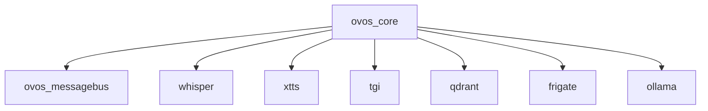

# AI_CODING_BASELINE_RULES

### How to Read This Guide
This document uses RFC 2119 keywords (MUST, SHOULD, MUST NOT, MAY) to indicate rule priorities.  
Any deviation from a MUST-level rule must follow Section X: Handling Exceptions and Deviations.  

## Table of Contents
1. [Configuration Consistency](#1-configuration-consistency)
2. [Environment Variables](#2-environment-variables)
3. [Volume Mounts and Permissions](#3-volume-mounts-and-permissions)
4. [Healthchecks and Dependencies](#4-healthchecks-and-dependencies)
5. [Version Pinning](#5-version-pinning)
6. [Testing and Verification](#6-testing-and-verification)
7. [Documentation](#7-documentation)
8. [Version Control (Git) Discipline](#8-version-control-git-discipline)
9. [AI Interaction Protocol & Change Management](#9-ai-interaction-protocol--change-management)
10. [Secrets Management](#10-secrets-management)
11. [Rollback and Recovery](#11-rollback-and-recovery)
12. [Automated Checks and Enforcement](#12-automated-checks-and-enforcement)
13. [AI/Human Collaboration Etiquette](#13-aihuman-collaboration-etiquette)
14. [Change Log Maintenance](#14-change-log-maintenance)
15. [Security Review](#15-security-review)
16. [AI Model/Tool Versioning](#16-ai-modeltool-versioning)
17. [Accessibility and Readability](#17-accessibility-and-readability)
18. [Standardized Logging Practices](#18-standardized-logging-practices)
19. [Network Design and Port Management](#19-network-design-and-port-management)
20. [Data Persistence and Backup Strategy](#20-data-persistence-and-backup-strategy)
21. [Update and Upgrade Procedures](#21-update-and-upgrade-procedures)
22. [Post-Stability Actions (Including Backups)](#22-post-stability-actions-including-backups)
23. [General Development Principles for Custom Code & Services](#23-general-development-principles-for-custom-code--services)
24. [Appendix: Example Automation Scripts & Templates](#appendix-example-automation-scripts--templates)
25. [Visualizations & Diagrams](#visualizations--diagrams)
26. [Periodic Review & Update Schedule](#periodic-review--update-schedule)
27. [Designing for Offline Capability & Portability](#27-designing-for-offline-capability--portability)
28. [Handling Exceptions and Deviations to These Rules](#x-handling-exceptions-and-deviations-to-these-rules)

> **Rule:** This guide must be referenced in all relevant code, configuration, and documentation files, and in all code reviews. Add a comment or note: "See AI_CODING_BASELINE_RULES.md for required practices."

This document defines the baseline rules and best practices that all AI agents, assistants, or automated code generation tools must follow when contributing to this project. **This guide must be referenced and adhered to whenever writing or reviewing any new code or documentation for any service in the stack.**

---

## Reviewer Checklist

| Review Item                        | Verified |
|------------------------------------|:--------:|
| AI-generated content tagged        |   [ ]    |
| Non-root container verified        |   [ ]    |
| Healthchecks & dependencies        |   [ ]    |
| Version pinning verified           |   [ ]    |
| Documentation updated              |   [ ]    |
| Rollback/Recovery scenario defined |   [ ]    |
| Security/vulnerability scan run    |   [ ]    |
| Test coverage adequate             |   [ ]    |
| Accessibility (WCAG compliance)    |   [ ]    |
| Benchmark/performance checked      |   [ ]    |
| Secrets managed securely           |   [ ]    |

---

## X. Handling Exceptions and Deviations to These Rules
<!-- id: EXC-01, priority: MUST, tags: [compliance], last_reviewed: 2025-05-13 -->
Any intentional deviation from these baseline rules must be a conscious, documented exception:
1. **Identify:** Reference the baseline rule(s) being deviated from.
2. **Justify:** Provide clear rationale for the deviation.
3. **Document:** Record the exception, justification, risks, and alternative approach in the relevant `[ServiceName]_SETUP_GUIDE.md` or `[ServiceName]_TROUBLESHOOTING_GUIDE.md` with a link back to this guide.
4. **Approve:** Obtain explicit approval from the primary maintainer before finalizing.

---

## 1. Configuration Consistency
<!-- id: CFG-01, priority: MUST, tags: [config] -->
- MUST: Always use the Docker Compose service name (e.g., `ovos_messagebus`) for all inter-container host references.
- SHOULD: Server processes SHOULD bind to `0.0.0.0` unless a specific interface is documented.
- SHOULD: Ensure all critical configuration sections match the canonical examples in `[ServiceName]_SETUP_GUIDE.md`, except under a documented exception.
- SHOULD: Namespace and document shared config file sections (e.g., `mycroft.conf`) per service in their setup guides.

## 2. Environment Variables
<!-- id: ENV-01, priority: MUST, tags: [environment] -->
- MUST: Set all required environment variables for each service in the relevant `docker-compose.*.yml` file as specified.
- MUST NOT: Override Compose-defined environment variables with hardcoded values in application code or entrypoint scripts unless explicitly documented.

## 3. Volume Mounts and Permissions
<!-- id: VOL-01, priority: MUST, tags: [volumes, permissions] -->
- MUST: Mount configuration and data directories exactly as described in each service’s setup guide, distinguishing read-only (`:ro`) vs. read-write.
- MUST: Clearly state in change previews if mounting or permission changes are intended.
- MUST: Ensure host and in-container permissions (`chmod`/`chown`) allow necessary access without granting excessive privileges.

---

## 4. Healthchecks and Dependencies
<!-- id: HC-01, priority: SHOULD, tags: [docker, healthchecks] -->
- SHOULD: Use `depends_on` with `condition: service_healthy` and robust healthcheck definitions.
- SHOULD: Prefer the exec form (`["CMD", …]`) over shell form for reliability.
- SHOULD: Tune `interval`, `timeout`, `retries`, and `start_period` to match service startup behavior.
- MUST NOT: Use always-passing healthchecks (e.g., ending in `|| true`) for critical services unless a documented exception exists.

## 5. Version Pinning
<!-- id: PIN-01, priority: SHOULD, tags: [docker, versioning] -->
- SHOULD: Pin base images, application versions, and key libraries (e.g., `python:3.11-slim`, `smartgic/ovos-core:0.1.0`).
- MUST: Document and test any version updates on a separate branch before merging.

## 6. Testing and Verification
<!-- id: TEST-01, priority: SHOULD, tags: [testing, verification] -->
- SHOULD: Provide test scripts or manual verification procedures for core functionality after changes.
- MUST: Run all relevant tests following modifications.
- SHOULD: Test on both Windows (Docker Desktop/WSL2) and native Linux hosts to catch cross-platform issues.

## 7. Documentation
<!-- id: DOC-01, priority: SHOULD, tags: [documentation] -->
- MUST: Maintain a `[ServiceName]_SETUP_GUIDE.md` and a `[ServiceName]_TROUBLESHOOTING_GUIDE.md` for each container.
- SHOULD: Reference this baseline guide in all service-specific documentation.
- SHOULD: Provide visual dependency diagrams (e.g., Mermaid, Graphviz) for complex stacks.
- SHOULD: Ensure documentation uses simple language and includes alt-text for images.

---

<!-- id: VCS-01, priority: MUST, tags: [git,version-control] -->
## 8. Version Control (Git) Discipline
- MUST: Commit all changes to code, configuration, and documentation with clear, descriptive messages following Conventional Commits.
- MUST: Require human review of AI-generated changes before commit; use `git diff` to inspect changes.
- SHOULD: Use branches for experiments and significant changes; test thoroughly on branches before merging.
- MUST NOT: Use `git push --force` on shared branches unless coordinated and documented.
- MUST: Maintain a comprehensive `.gitignore` and review it regularly.
- MUST: Pull latest changes before starting new work to avoid conflicts.
- MUST: Follow commit message format: summary line ~50 characters, body wrapped at 72 characters, using Conventional Commits.
- MUST: Enforce LF line endings for Linux files via `.gitattributes` and Git settings.
- MUST: Treat filenames, imports, and environment variable names as case-sensitive.
- SHOULD: Resolve merge conflicts by understanding all changes and testing thoroughly before finalizing.

<!-- id: AIP-01, priority: MUST, tags: [ai,change-management] -->
## 9. AI Interaction Protocol & Change Management
- MUST: Seek explicit user confirmation before performing any destructive action.
- MUST: Clearly state intent, affected files/services, and expected outcomes before applying changes.
- MUST: Make changes incrementally and atomically; each change must be testable and reviewable.
- SHOULD: Prompt for backups of critical files before modification or advise user to back up large volumes.
- SHOULD: Log AI actions in commit messages or relevant logs with standardized tags (`AI-GENERATED`, `AI-REVIEWED`).

<!-- id: SEC-01, priority: MUST, tags: [secrets] -->
## 10. Secrets Management
- MUST: Never hardcode credentials or secrets in code, configuration, or documentation.
- MUST: Use Docker secrets, environment variables, or external vaults for secret management.
- SHOULD: Define and document secret rotation intervals; rotate at least quarterly.
- SHOULD: Establish audit logging for secret access and changes.
- MUST: Have an emergency plan for secret revocation and rotation.

<!-- id: ROR-01, priority: MUST, tags: [rollback,recovery] -->
## 11. Rollback and Recovery
- MUST: Know rollback procedures (e.g., `git revert`, backup restore) before making significant changes.
- MUST: Ensure backups or restore points exist before breaking changes.
- SHOULD: Document rollback scenarios and examples in service-specific guides.

<!-- id: AUTO-01, priority: SHOULD, tags: [automation,ci] -->
## 12. Automated Checks and Enforcement
- SHOULD: Use linting, formatting, and validation tools (e.g., pre-commit hooks) before merges.
- MUST: Run automated checks on relevant files upon each change.
- SHOULD: Integrate commitlint or Husky to enforce Conventional Commits.
- SHOULD: Instrument CI/CD to track build/test metrics and set alerts for failures.

<!-- id: AHC-01, priority: SHOULD, tags: [ai,collaboration] -->
## 13. AI/Human Collaboration Etiquette
- SHOULD: Always allow human review of AI-generated suggestions.
- SHOULD: Encourage human feedback in code reviews and commit messages.
- MUST: Document conflicting advice, decision process, and rationale in commits or guides.

<!-- id: CHG-01, priority: MUST, tags: [changelog] -->
## 14. Change Log Maintenance
- MUST: Maintain `CHANGELOG.md` to track significant changes.
- SHOULD: Note AI-made changes explicitly for transparency.

<!-- id: SEC-REV-01, priority: SHOULD, tags: [security] -->
## 15. Security Review
- SHOULD: Periodically scan dependencies and images for vulnerabilities (e.g., `pip-audit`, Trivy).
- SHOULD: Test updates on branches before merging.
- MUST: Run vulnerability scans using tools like Snyk or GitHub Advanced Security.
- MUST: Run containers as non-root users; document exceptions.
- MUST: Use Linux-based parent images; avoid Windows containers.

<!-- id: MODEL-VER-01, priority: SHOULD, tags: [ai,versioning] -->
## 16. AI Model/Tool Versioning
- SHOULD: Specify AI tool or model versions used for significant changes.

<!-- id: ACC-01, priority: SHOULD, tags: [accessibility] -->
## 17. Accessibility and Readability
- SHOULD: Write clear, concise documentation; strive for WCAG 2.1 compliance.
- SHOULD: Use automated accessibility tools (e.g., axe-core, Lighthouse).

<!-- id: LOG-01, priority: SHOULD, tags: [logging] -->
## 18. Standardized Logging Practices
- MUST: Log to stdout/stderr; avoid internal files unless documented.
- SHOULD: Use configurable log levels; default to INFO in production.
- SHOULD: Prefer structured logging (e.g., JSON) where feasible.

<!-- id: NET-01, priority: SHOULD, tags: [network] -->
## 19. Network Design and Port Management
- SHOULD: Define explicit Docker networks for related services.
- MUST: Check for host port conflicts before exposing.
- SHOULD: Document inter-service communication in setup guides.

<!-- id: DATA-01, priority: MUST, tags: [data,persistence] -->
## 20. Data Persistence and Backup Strategy
- MUST: Define ephemeral vs. persistent data per service; document in setup guides.
- SHOULD: Remind to backup version-controlled files and volumes after stable changes.

<!-- id: UPG-01, priority: SHOULD, tags: [updates] -->
## 21. Update and Upgrade Procedures
- SHOULD: Use specific version tags over `latest` for predictability.
- MUST: Test image and dependency updates on branches before merging.
- SHOULD: Document known breaking changes in troubleshooting guides.

<!-- id: POST-01, priority: SHOULD, tags: [backup,post-deployment] -->
## 22. Post-Stability Actions (Including Backups)
- MUST: Upon stability confirmation, remind user to backup code, configs, and volumes.

---

<!-- id: DEV-01, priority: SHOULD, tags: [development,custom-code] -->
## 23. General Development Principles for Custom Code & Services

<!-- id: DAP-01, priority: SHOULD, tags: [design,architecture], last_reviewed: 2025-05-13 -->
### 23.2. Design and Architecture Principles
- MUST: Design components to be modular with single responsibilities (SRP).
- SHOULD: Promote code reuse and reduce coupling through abstraction and interfaces (DIP, ISP).
- SHOULD: Design for extensibility (OCP) allowing new functionality with minimal changes.
- SHOULD: Implement and document design patterns (Factory, Observer, Strategy, Decorator) with rationale.
- SHOULD: Follow SOLID principles for flexible, maintainable design.
- SHOULD: Employ dependency injection to provide components with dependencies externally.

<!-- id: EH-01, priority: MUST, tags: [error-handling,robustness], last_reviewed: 2025-05-13 -->
### 23.3. Error Handling and Robustness
- MUST: Implement comprehensive error handling using language-appropriate constructs to catch and manage exceptions.
- MUST: Define and use custom exception types for application-specific error conditions.
- MUST: Log all exceptions and significant error states with sufficient context (stack trace, parameters).
- MUST: Rigorously validate all external inputs at component boundaries to prevent errors and vulnerabilities.

<!-- id: PERF-01, priority: SHOULD, tags: [performance,scalability], last_reviewed: 2025-05-13 -->
### 23.4. Performance and Scalability
- SHOULD: Choose efficient algorithms and data structures appropriate for task and data sizes.
- SHOULD: Utilize appropriate concurrency mechanisms (asyncio, threading, multiprocessing) for parallelism.
- SHOULD: Profile code to identify bottlenecks before optimizing critical paths.
- MUST: Manage system resources efficiently, ensuring proper cleanup of resources (context managers, finally blocks).
- SHOULD: Establish and rerun performance benchmarks after significant changes.

<!-- id: QA-01, priority: SHOULD, tags: [testing,qa], last_reviewed: 2025-05-13 -->
### 23.5. Testing and Quality Assurance
- MUST: Implement comprehensive unit tests covering new and modified code.
- MUST: Write integration tests for interactions between components or services.
- SHOULD: Aim for high test coverage of business logic and critical paths.
- MUST: Structure code to be easily testable (SRP, DI, limited global state).

<!-- id: SBP-01, priority: MUST, tags: [security], last_reviewed: 2025-05-13 -->
### 23.6. Security Best Practices
- MUST: Validate and sanitize all inputs from untrusted sources to prevent injection and traversal attacks.
- MUST: Enforce the principle of least privilege for processes and services.
- MUST: Regularly scan and update dependencies to patch known vulnerabilities.
- MUST: Protect sensitive data with encryption at rest and in transit, and avoid logging sensitive information.

<!-- id: CICD-02, priority: SHOULD, tags: [cicd,automation], last_reviewed: 2025-05-13 -->
### 23.7. CI/CD (Continuous Integration & Continuous Deployment)
- SHOULD: Automate build, test, and deployment processes through CI/CD pipelines.
- SHOULD: Maintain consistency between development, testing, and production environments.
- SHOULD: Integrate containerization and declarative configs to reduce environment drift.

<!-- id: PY-01, priority: SHOULD, tags: [python], last_reviewed: 2025-05-13 -->
### 23.8. Python-Specific Development Guidelines
- MUST: Adhere to PEP 8 style guide for Python code formatting.
- SHOULD: Use type hints for function arguments and return values where they improve clarity.
- MUST: Include docstrings for all public modules, classes, functions, and methods.
- SHOULD: Use linters (Flake8, Pylint) and formatters (Black, isort) via pre-commit hooks.
- SHOULD: Leverage Pythonic idioms (list comprehensions, context managers).
- SHOULD: Use Abstract Base Classes and decorators for interfaces and cross-cutting concerns.
- MUST: Catch specific exceptions and ensure resource cleanup with context managers.
- SHOULD: Utilize asyncio for I/O-bound concurrency and multiprocessing for CPU-bound tasks.
- SHOULD: Write tests with pytest or unittest, using mocking and measuring coverage.
- MUST: Isolate dependencies in virtual environments and pin versions in requirements.txt.
- SHOULD: Avoid unsafe use of pickle and sanitize inputs in web contexts.

<!-- id: APP-01, priority: MAY, tags: [appendix,scripts,templates], last_reviewed: 2025-05-13 -->
## 24. Appendix: Example Automation Scripts & Templates

### Example Docker Compose Snippet (Healthchecks & Explicit Networks)

```yaml
version: '3.8'
services:
  example_service:
    image: example/image:1.0.0
    container_name: example_service
    restart: unless-stopped
    networks:
      - example_network
    healthcheck:
      test: ["CMD", "curl", "-f", "http://localhost:8080/health"]
      interval: 10s
      timeout: 5s
      retries: 3
      start_period: 15s
    environment:
      - EXAMPLE_ENV=production
    ports:
      - "8080:8080"
networks:
  example_network:
    driver: bridge
```

<!-- id: VIS-01, priority: SHOULD, tags: [visualization,diagrams], last_reviewed: 2025-05-13 -->
## 25. Visualizations & Diagrams

- For complex stacks, generate and include service dependency graphs or flowcharts.
- Tools: [Mermaid](https://mermaid-js.github.io/), [Graphviz](https://graphviz.gitlab.io/), or [draw.io](https://app.diagrams.net/).
- Example (Mermaid):



<!-- id: REV-01, priority: MUST, tags: [review,schedule], last_reviewed: 2025-05-13 -->
## 26. Periodic Review & Update Schedule

- **Review Frequency:** These guidelines must be reviewed and updated at least quarterly (every 3 months) or after any major stack or process change.
- **Review Process:**
    - Assign a maintainer or rotating reviewer.
    - Solicit feedback from all contributors (AI and human).
    - Document all changes in `CHANGELOG.md`.
    - Confirm continued alignment with industry best practices and project needs.

<!-- id: OFF-01, priority: SHOULD, tags: [offline,portability], last_reviewed: 2025-05-13 -->
## 27. Designing for Offline Capability & Portability

*To maximize the stack's ability to be deployed and maintained in offline or air-gapped environments, the following principles apply:*

1.  **Minimize Online Dependencies for Core Functionality:**
    * Services **should be designed and configured** to perform their core functions without requiring continuous internet access, where feasible.
    * Clearly differentiate between essential offline functionality and features that inherently require an internet connection (e.g., fetching live news, certain cloud-based AI models).
2.  **Explicitly Document Online Requirements:**
    * For any service, plugin, or feature that *does* require internet access (even if only for initial setup like model downloads or package installation), this dependency **must be clearly documented** in its respective `[ServiceName]_SETUP_GUIDE.md`. Include details about what is fetched and when.
3.  **Support for Localized Resources:**
    * Configurations **must** allow services to be pointed to locally hosted resources (e.g., local model directories, local package repositories, local service endpoints) instead of relying solely on hardcoded public internet URLs. This is crucial for offline operation.
4.  **Dockerfile and Build Process Considerations for Offline Builds:**
    * Custom Docker image builds **should strive to support offline assembly** once all initial base images and source dependencies (code, packages, models) have been pre-fetched during an online phase.
    * This may involve:
        * Using multi-stage Docker builds to separate online-dependent fetching/compilation from the final offline-buildable image.
        * Strategies for vendoring dependencies (e.g., Python wheels, system packages) if local mirrors are not used.
        * Ensuring build scripts do not attempt to reach the internet if an "offline build" mode is active or if local resources are present.
5.  **Configuration Over Internet Checks:**
    * Services should provide configuration options to disable automatic update checks or other non-essential internet call-outs if they might fail or cause issues in an offline environment.

---

**This guide is mandatory. All new code, configuration, and documentation must comply with these rules.**
````
